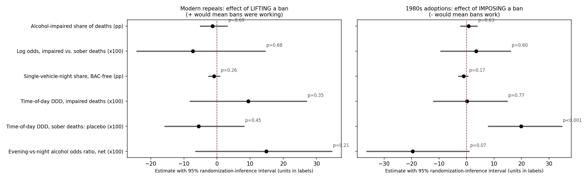

# Happy Hour Laws and Alcohol-Impaired Traffic Deaths

**Do bans on happy hour drink discounts reduce drunk-driving deaths?**
Using every fatal U.S. crash from 1982 to 2024 and two natural experiments (three states that lifted bans in 2012–2018, and six states that adopted bans in 1984–1989), I find no detectable effect in either direction. The 1980s bans did not lower the share of traffic deaths involving an impaired driver by more than about 2 percentage points, roughly 5% of the baseline.

Elliot Louis · Trinity College, B.A. Economics (expected May 2027) · [linkedin.com/in/elliot-louis](https://linkedin.com/in/elliot-louis)

📄 **[Read the full paper (PDF)](paper/happy_hour_report.pdf)**

---

## The question

States have banned happy hour pricing to cut binge drinking and drunk driving, and several are now debating lifting those bans. Massachusetts, which banned happy hour in 1984, is currently considering a local-option repeal. Because states changed their laws at different times, I compare the fatality trends of states that changed their law with the trends of similar states that did not, before and after each change.

| Experiment | Treated states | Comparison group |
| --- | --- | --- |
| Modern repeals | Kansas (2012), Illinois (2015), Oklahoma (2018) | All other states, 1994–2024 |
| 1980s bans | Massachusetts, Kansas, Indiana, North Carolina, Vermont, Illinois (1984–1989) | The 29 states where a law-by-law check found no statewide happy-hour change in 1980–1995 |

## Data

| Source | Used for | Years |
| --- | --- | --- |
| NHTSA Fatality Analysis Reporting System (FARS), crash-level files with multiply imputed driver BACs | Alcohol-impaired deaths (highest driver BAC ≥ 0.08), matching NHTSA's official definition. 1.74 million deaths in total | 1982–2024 |
| Law-by-law coding from statutes, regulations, the 1994 NHTSA legislative digest and NIAAA's Alcohol Policy Information System | Law dates and strength (`data/inputs/coding_1980s_verified.csv`) | 1980–2024 |
| FHWA Highway Statistics, Table VM-2 | Vehicle-miles traveled, rural share of driving | 1980–2024 |
| FRED (BLS unemployment, Census population) | Economic controls, per-capita rates | 1982–2024 |
| Ruhm (1996); Cohen & Einav (2003) state panels (AER package) | Drinking age; seat-belt, speed-limit and BAC-law controls | 1982–1997 |

The data build reproduces NHTSA's published national totals within 1% (for example, 10,212 impaired deaths in 2019 against NHTSA's 10,142). Every check is listed in `results/audit_log.md`.

## Method

- **Imputation difference-in-differences** (Borusyak, Jaravel & Spiess, 2024). This stays reliable when states change their laws in different years, a case where the standard two-way fixed effects regression can be biased.
- **Randomization inference.** With only three to six treated states, conventional standard errors are unreliable. Instead, each state's real law dates are given to similar-size states that never changed their law, and the model is re-run 5,000 times to see how large an estimate chance alone produces. Simulations show this test is slightly liberal (7–8% false positives at the 5% level), which the paper takes into account.
- **Synthetic control and synthetic difference-in-differences** for each modern repeal, as state-by-state checks.
- **Mechanism tests.** Happy hours happen on weekday evenings, so I compare evening crashes with late-night crashes, using sober crashes as a placebo that a happy hour law should not affect.

## Results



| Outcome | Effect of lifting a ban (modern repeals) | Effect of imposing a ban (1980s) |
| --- | --- | --- |
| Impaired share of deaths | −1.4 pp [−5.0, 3.0], p = 0.69 | +0.8 pp [−2.1, 3.8], p = 0.63 |
| Log odds, impaired vs. sober deaths (×100) | −7.3 [−24.2, 14.5], p = 0.68 | +3.5 [−9.3, 16.0], p = 0.60 |
| Impaired deaths per vehicle-mile | +1.5% [−15.6%, +23.7%] | +3.7% [−8.9%, +15.5%] |

*Average over the first six full years under the new law. Brackets are 95% randomization-inference intervals.*

*The poster figures (`figures/poster_*`) come from `code/final_specs.py`, which draws its own randomization samples, so its intervals can differ from the paper's in the last digit.*

Pooling all nine law changes, having a ban changes the odds that a traffic death involved an impaired driver by +5% (95% interval −7% to +16%). Across 50 specifications (Figure 9 in the paper), including drinking-age, traffic-safety, vehicle-mile, unemployment and population controls, alternative codings of the 1980s laws, dropping neighboring states, and dropping each treated state in turn, no impaired-share estimate is statistically significant.

Other findings from the follow-up checks:

- **Illinois.** Synthetic control flagged Illinois as a significant increase after 2015. The result depends on a few Southern comparison states: it disappears without them and appears at a fake 2008 date as well.
- **1980s crash timing.** After the 1980s bans, sober crashes shifted from late night toward weekday evenings while impaired crashes did not. A happy hour law cannot produce that pattern, so it is not an alcohol effect.
- **Weekday vs. weekend evenings.** After the modern repeals, alcohol involvement rose on weekday evenings relative to weekend evenings (calibrated p ≈ 0.05). This is suggestive of repeals shifting when impaired crashes happen rather than how many there are, but it is not a finding on its own.
- **Partial restrictions.** Weaker 1980s partial restrictions show a significant drop, but it rests on Maine and Ohio, which changed other drunk-driving laws at the same time.

## Limitations

- Missing BACs are imputed by NHTSA partly from time of day, which weakens the evening-vs-night tests.
- There are few treated states, and some reforms came bundled with other liquor law changes (Kansas 2012, Oklahoma 2018).
- Vermont's 1980s adoption year and a few exact dates remain unverified.
- Indiana's July 2024 change can't be evaluated until 2025 FARS data are released.

## Repository structure

```
├── README.md
├── LICENSE                      MIT for code; CC BY 4.0 for the paper and figures
├── requirements.txt
├── paper/
│   ├── happy_hour_report.pdf
│   └── happy_hour_report.docx
├── code/
│   ├── run_all.sh               runs everything below in order
│   ├── paths.py, designs.py     repository paths; the two experiments, defined once
│   ├── estimator.py, ri.py      imputation DiD and joint randomization inference
│   ├── sdid.py                  synthetic difference-in-differences
│   ├── build_fars.py            raw FARS -> data/fars_agg (optional; aggregates are included)
│   ├── analysis.py              main estimates, synthetic control, Figures 1-4
│   ├── followup.py              Illinois tests, synthetic DiD, 1980s traffic-safety controls
│   ├── vmt_extension.py         deaths per vehicle-mile
│   ├── fred_extension.py        unemployment and population
│   ├── tests_now.py             simulations, date sensitivity, Indiana early look
│   ├── recode_1980s*.py         alternative 1980s codings
│   ├── more_tests*.py           mechanism checks, pooled estimate, specification curve
│   ├── final_specs.py           poster figures
│   ├── audit.py                 independent checks -> results/audit_log.md
│   └── report/build_report.js   builds the paper from the result tables
├── data/
│   ├── inputs/                  law coding, AER panels, FRED, FHWA VM-2
│   ├── fars_agg/                FARS state x year x weekday x hour aggregates, 1982-2024
│   └── raw/                     raw 2016-2024 NHTSA files (not tracked)
├── results/                     analysis panels, result tables, audit log
└── figures/
```

## How to reproduce

1. Clone this repository.
2. Install Python 3.12 and the packages in `requirements.txt` (`pip install -r requirements.txt`), plus Node.js if you want to rebuild the paper.
3. Run `bash code/run_all.sh`. It uses the included FARS aggregates, so no large downloads are needed; the whole run takes about 15 minutes.
4. To rebuild the FARS aggregates from scratch, download NHTSA's national CSV files for 2016–2024 (the accident and MIPER files) into `data/raw/` and run `python code/build_fars.py`. Files for 1982–2015 download automatically from a mirror of NHTSA's archive (github.com/wgetsnaps/ftp.nhtsa.dot.gov--fars).

## How this was built

I designed the research question, chose the natural experiments, sourced and checked the data, and reviewed every result. The code was written in part by Claude (Anthropic's AI assistant) under my direction, and I used an AI research tool to gather primary legal sources for the 1980s law dates. I treated AI output as something to verify, not trust: reviewing results led to two corrections that changed the paper (an overstated Illinois finding, and an inference method that produced too many false positives), and `code/audit.py` re-derives the key results independently.

## Key references

- Borusyak, K., Jaravel, X., & Spiess, J. (2024). Revisiting event-study designs: Robust and efficient estimation. *Review of Economic Studies*, 91(6), 3253–3285.
- Arkhangelsky, D., Athey, S., Hirshberg, D. A., Imbens, G. W., & Wager, S. (2021). Synthetic difference-in-differences. *American Economic Review*, 111(12), 4088–4118.
- Conley, T. G., & Taber, C. R. (2011). Inference with "difference in differences" with a small number of policy changes. *Review of Economics and Statistics*, 93(1), 113–125.

Full reference list in the paper.
